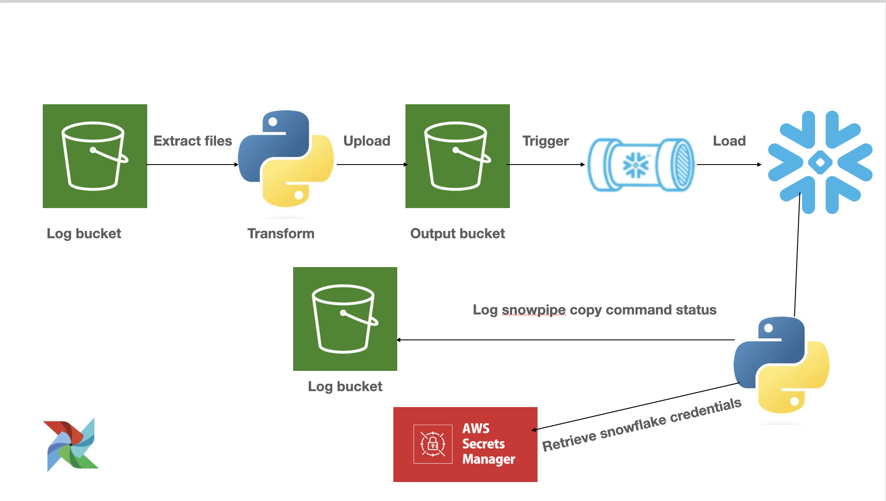

# Global terrorism data engineering project 🌐
This project provides an end-to-end data engineering pipeline to extract data from s3 bucket and process it. Snowpipe is triggered to copy data into a transient table in snowflake, then log file of the copy command will be stored in another s3 bucket for auditing

## 📝 Table of Contents
- [System Architecture](#system-architecture)
- [Setup & Requirements](#-setup--requirements)
- [Usage](#-usage)

## System Architecture

## 🛠 Setup & Requirements
1. **AWSAccount**: Ensure you have an active AWS account.
2. **Knowledge required**: Aws services, snowflake fundamentals, pipeline ochrestration tool (airflow), analysis with python.
3. **Libraries**: Install the required Python libraries:
   - pandas
   - boto3
   - snowflake-connector-python
   - apache-airflow

## 🚀 Usage
1. **Data source**: https://www.start.umd.edu/gtd/
2. **Create aws resources with cloudformation**: Use cloudformation file named `setup.yaml` in the aws cloudformation service and upload original files to the log bucjet.
3. **Run the Commands**: Execute the provided `commands.txt` or `requirements.txt`.
4. **Run pipeline**: Login to your snowflake account and run sql statements in `snowfalke_sql.txt` to set up necessary infrastructure
5. **IAM identities**: Provide ec2 instance and snowflake approriate permissions to work
6. **Run pipeline**: Login to the airflow webserver and copy `dags` folder in airflow folder on ec2 instance, then trigger the dag.
7. **Check Data**: check transformed data and log file in s3 buckets.

